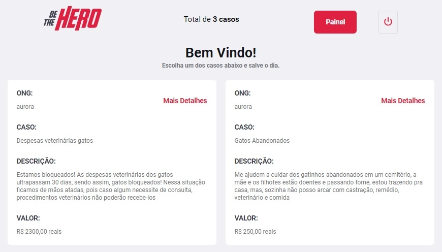
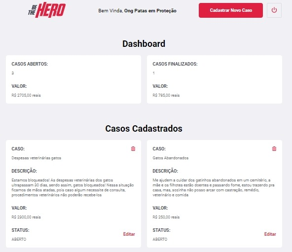

<h1 align="center">
    
</h1>

<h4 align="center">
  🚀 Semana OmniStack 11.0 - Django 
</h4>

<p align="center">
  <a href="#rocket-tecnologias">Tecnologias</a>&nbsp;&nbsp;&nbsp;|&nbsp;&nbsp;&nbsp;
  <a href="#-projeto">Projeto</a>&nbsp;&nbsp;&nbsp;|&nbsp;&nbsp;&nbsp;
  <a href="#hammer-instalação">Instalação</a>&nbsp;&nbsp;&nbsp;|&nbsp;&nbsp;&nbsp;
  <a href="#-layout">Layout</a>&nbsp;&nbsp;&nbsp;|&nbsp;&nbsp;&nbsp;
  <a href="#-como-contribuir">Como contribuir</a>&nbsp;&nbsp;&nbsp;|&nbsp;&nbsp;&nbsp;
  <a href="#memo-licença">Licença</a>
</p>

<br>



## :rocket: Tecnologias

Esse projeto foi desenvolvido com as seguintes tecnologias:

- [Django](https://www.djangoproject.com/)
- [Jinja](https://jinja.palletsprojects.com/en/2.11.x/)
- [Django Rest Framework](https://www.django-rest-framework.org/)

## 💻 Projeto

O BeTheHero é um projeto que visa conectar pessoas que desejam fazer contribuições monetárias a ONG's (Organizações não governamentais) que precisam de ajuda.

## :hammer: Instalação

Dentro da pasta do projeto execute

Instalação dos pacotes:

```
pip install -r requirements.txt
```

Preparar os arquivos de migração:

```
python manage.py makemigrations
```

Para aplicar as migrações no model execute:

```
python manage.py migrate
```

Criação do Usuário Admin:

```
python manage.py createsuperuser
```

Rodando a Aplicação:

```
python manage.py runserver
```

## 🔖 Layout

Você pode visualizar o layout do projeto no formato através [desse link](https://www.figma.com/file/2C2yvw7jsCOGmaNUDftX9n/Be-The-Hero---OmniStack-11?node-id=37%3A394). Lembrando que você irá precisar ter uma conta no [Figma](http://figma.com/).

## 🤔 Como contribuir

- Faça um fork desse repositório;
- Cria uma branch com a sua feature: `git checkout -b minha-feature`;
- Faça commit das suas alterações: `git commit -m 'feat: Minha nova feature'`;
- Faça push para a sua branch: `git push origin minha-feature`.

Depois que o merge da sua pull request for feito, você pode deletar a sua branch.

## :memo: Licença

Esse projeto está sob a licença MIT. Veja o arquivo [LICENSE](LICENSE.md) para mais detalhes.

---

Projeto Original ♥ by Rocketseat :wave: [Participe da nossa comunidade!](https://discordapp.com/invite/gCRAFhc)

Recriado por [Plinio Mikael](https://github.com/pliniomikael)
